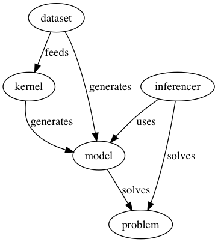

# Datasets, Kernels, Models, and Problems

As we start publishing more datasets and models, it is important to keep in mind why we're doing this.

> We publish datasets because we want to contribute back to the Open Source and Machine Learning communities.

We consider datasets and models to be good when they are:
- discoverable,
- reproducible, and
- reusable.

Keeping all of this in mind, let me propose a way to write documentation for these.

## A Common Vocabulary

It seems to be quite established that the relationship between datasets, models, and other concepts is somehow expressed in the following graph.


<!--
To rebuild the graph above, run:

$ dot -Tpng -o graph.png

And give the following as input:

digraph G {
	dataset -> kernel [ label = "feeds" ];
        {kernel dataset} -> model [ label = "generates" ];
        model -> problem [ label = "solves" ];
        predictor -> model [ label = "uses" ];
        predictor -> problem [ label = "solves" ];
}
-->

The following sections get into more detail on each concept,
but let me give a quick intro of all of these concepts.

### Problems

Everything we do at source{d} is around solving problems and
making predictions. Problems are the starting motivation
and ending point of most of our Machine Learning processes.

Problems have a clear objective, and a measure of success that
let us rank different solutions to any problem in an objective
way. Think about accuracy, recall, etc.

An example problem could be predicting what is the next key
a developer will press given what they've written so far.

### Models

Problems are solved using Models. Models are trained
to solve a specific problem by feeding Dataset to a
Kernel that optimizes a set of parameters.
These parameters, once optimized, are what models are made of.

Models can be considered as a black box, where the only thing
we care about is the input and output formats. This provides
the possibility of reusing a model, to solve the same problem,
or to somehow feed into a different model (by knowledge
transfer or other techniques).

Given the previous problem of predicting the next key pressed,
a model could get as an input the sequence of all keys pressed
so far, as ASCII codes, and the output could be a single ASCII
code with the prediction.

A secondary goal of models is to be reproducible, meaning that
someone could try to repeat the same process we went through and
expect to obtain a similar result. If the kernel that generated
the dataset requires metaparameters (such as learning rate),
these values should also be documented.

This is normally documented in research papers, with references
to what datasets and kernels were used, as well as how much
training time it took to obtain the resulting model.

### Kernels

Kernels are algorithms that feed from datasets and
generate models. These algorithms are responsible for describing
the model architecture chosen to solve a problem, e.g. RNN,
CNN, etc, and what metaparamaters were used

### Datasets

Datasets contain information retrieved from one or more
data sources, then pre-processed so it can easily be used to
answer questions, solve problems, train models, or even as
the data source to another dataset.

The most important aspects of a dataset are its format, how to
download it, reproduce it, and what version contains what
exactly.

Datasets evolve over time, and it's important to have versions
that can be explicitly referred to from trained models.

### Predictor

The last piece of the puzzle is what I call a predictor.
A predictor uses a model (sometimes more, sometimes no model
at all) to predict the answer to a question given some input.

For instance, given a model trained with a large dataset of
the keystrokes of thousands of developers, we could write a
predictor that uses that trained model to create predictions.
That would be a pretty decent predictor.

But we could also use a simple function that outputs random
ASCII codes, ignoring any other information available. This
predictor would probably have a lower accuracy for the given
problem.

## Documenting these Artifacts

So far we've documented models and some datasets to a certain
extent, but I think it's time to provide a framework for all
of these elements to be uniformly documented to improve the
discoverability, reproducibility, and reusability of our
results.

We will evolve our documentation over time, into something that
hopefully will delight every one of our engineers and users.
But for now, let's keep it realistic and propose a reduced set
of measure we can start applying today to evolve towards that
perfect solution.

## Current status

Currently we document only datasets and models in two different
repositories: github.com/src-d/datasets and
github.com/src-d/models.

We also have a modelforge tool that is intended to provide a way
to discover and download existing models.

### Datasets

We currently have only one public dataset: Public Git Archive.
For this dataset we document:

- how to download the current version of the dataset with the `pga` CLI tool
- how to reproduce the dataset with borges and GHTorrent

What are we missing?

- versioning of the resulting dataset, how to download this an previous versions?
- format of the dataset
- what other datasets (and versions) were used to generate this?
- what models have been trained with this dataset
- LICENSE (the tools and scripts are licensed, but not the datasets?)

### Models

Models are already documented following some structure, following the
efforts put in place for [modelforge](https://github.com/src-d/modelforge).

Currently models have an ID, which looks like a long random string like
`f64bacd4-67fb-4c64-8382-399a8e7db52a`.

Models are accompanied by an example on how to use them, unfortunately the
examples are a bit simpler than expected. They mostly look like this:

```python
from ast2vec import DocumentFrequencies
df = DocumentFrequencies().load()
print("Number of tokens:", len(df))
```

What are we missing?
- Versioned models, corresponding to versioned datasets.
- Reference to the code (kernel) that was used to generate the model.
- Technical sheet with accuracy, recall, etc for the given model and dataset
- Format of input and output of the model
- At least one example using the model to make a prediction

## My Proposal

Since we care about individual versioning of datasets and models,
it seems like it's an obvious choice to use a git repository per dataset,
and model.

Problems, predictors, and kernels can, for now, be documented directly with
a model. If we see that we start to have too much repetition because we have
many models for a single problem we will reassess this decision.

### Dataset Repository

A dataset repository should contain the following information:

- short description
- long description and links to papers and blog posts
- technical sheet
    - size of dataset
    - schema(s) of the dataset
    - download link
- using the dataset:
    - downloading the dataset
    - related tools
- reproducing the dataset:
    - link to the original data sources
    - related tools

### Model Repository

A dataset repository should contain the following information:

- short description
- long description and links to papers and blog posts
- technical sheet
    - size of model
    - input/output schemas
    - download link
    - datasets used to train the model (including versions)
- using the model:
    - downloading the model
    - loading the model
        - prerequisites (tensorflow? keras?)
    - quick guide: making a prediction
- reproducing the model:
    - link to the original dataset
    - kernel used to train the model
    - training process
        - hardware and time spent
        - metaparameters if any
        - any other relevant details

### General

As any other source{d} repository, we need to follow the guidelines in
[Documentation at source{d}](https://github.com/src-d/guide/blob/master/engineering/documentation.md).
This includes having a CONTRIBUTING.md, Code of Conduct, etc.

Every time a new version of a dataset or model is released a new tag and
associated release should be created in the repository.
The release should include links to anything that has changed since the
previous relaease: such as a new version of the datasets or changes in
the kernel.

### github.com/src-d/datasest and github.com/src-d/models

These two repositories should simply contain what is common to all datasets,
or to all models. They will also provide all the tooling build on top of
the documentation for datasets and models.

Since we imagine these tools extracting information from the repositories
automatically, it is important to keep formatting in mind.

I'm currently considering whether a `toml` file should be defined containing
the data common to all the datasets and models.
For instance, we could have the download size for each dataset and model,
as well as the associated schemas. A simple tool could then generate
documentation based on these values.