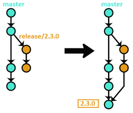

Web application deployment workflow.
====

<!-- TOC -->

- [Intro](#intro)
- [Quick summary:](#quick-summary)
    - [branches](#branches)
    - [Continuous delivery](#continuous-delivery)
- [General workflow](#general-workflow)
- [Deploying into Production](#deploying-into-production)
    - [special cases](#special-cases)
        - [Release branch](#release-branch)
        - [Exceptions](#exceptions)
- [Deploying into Staging](#deploying-into-staging)

<!-- /TOC -->

# Intro

This documentation assumes the [company deployment workflow](git-flow.md) is already known, and extends it to cover the continuous delivery as it should work for all source{d} web applications:

repo | Prod | Staging
--- | --- | ---
[src-d/landing](https://github.com/src-d/landing) | [sourced.tech](https://sourced.tech) | [landing-staging.srcd.run](https://landing-staging.srcd.run)
[src-d/blog](https://github.com/src-d/blog) | [blog.sourced.tech](http://blog.sourced.tech) | [blog-staging.srcd.run](https://blog-staging.srcd.run)

This document does not pretend to be exhaustive but as just a guide, and there can be special cases that will be defined in the README.md and CONTRIBUTING.md of each web application repository.

This document is based on the agreements of the [2017-10-23 CD workflow](https://github.com/src-d/minutes/blob/master/infrastructure/2017-10-23-landing-cd-workflow.md) and [2017-10-26 Enforcing the CD workflow](https://github.com/src-d/minutes/blob/master/infrastructure/2017-10-26-enforcing-cd-workflow.md) meetings.

# Quick summary:

Here are the technical details of when CI or CD runs, but you need to know and understand the guides and conventions explained below this section.

## branches
- `master` branch must always be production ready and will reflect the code deployed into Production.
- there are no long-term branches but `master`,
- `staging` branch must not be merged into other branches,
- `staging` branch should be kept as close to master as possible,

## Continuous delivery
CI and CD is controlled [by drone](https://drone.srcd.host)

- It is automatically deployed into Production when something is tagged,
- it is automatically deployed into Staging when the `src-d:staging` branch is updated,
- CI automatically runs when a PR against `master` or a `release/*` branch is created or updated with new commits.

# General workflow

`master` branch must "always" be production ready.

`master` branch will contain only approved commits through a PR.

`master` branch is the starting point for feature branches (considering some [special cases](#special-cases))

Since the workflow in the source{d} web applications used to be closely guided by Product, it is quite likely that it is needed to obtain its approval before merging into `master`; the repository [Maintainers](maintainers.md) will decide if any PR must be reviewed by Product, by themselves or by any other person.

# Deploying into Production

The deployment of the source{d} web applications is done [by drone](https://drone.srcd.host) when a commit is tagged.

To tag something &ndash;and deploy&ndash; something, we follow the following conventions:

- All tags must follow [Semantic Versioning 2](http://semver.org),
- All tags must be reachable from `master` branch,
- Tags must be done from a merge commit into `master` branch,
- Every time something is merged into master, there must be a tag pointing to that merge;

## special cases

### Release branch

When it is needed to merge many PRs and deploy only the last one (for example during a redesign), the feature branches will be created from a release branch, and merged into that same branch.

The release branches will be named with the pattern `release/__TAG_NAME__` being `__TAG_NAME__` the expected tag name that will be given when the release branch has been approved and merged into master.

### Exceptions

There can be some special exceptions that would require merging into master some PRs consecutively, and only to tag the last one; when it is needed to proceed that way, only a few minutes should elapse between the first commit &ndash;not being tagged&ndash;, and the last one &ndash;being tagged&ndash;.

# Deploying into Staging

Whenever `staging` branch is updated,  [drone](https://drone.srcd.host) automatically deploys it to Staging environment.

`staging` branch is not a long-term branch, so it should be kept as close to `master` as possible.

The project maintainer and team members working with that project will decide when `staging` should be reset to `master` or a `release/*` branch, considering its current state and other features that could be tested in Staging.

Since the `staging` branch contains commits not approved, those ones must be kept outside from `master` or any other branch that could be merged against `master` &ndash;like release or feature branches&ndash;. Due to the necessity of keeping that risk as low as possible, it can be taken as a general rule that `staging` branch must not be merged into any branch &ndash;neither into the remote `src-d:staging`&ndash;.
