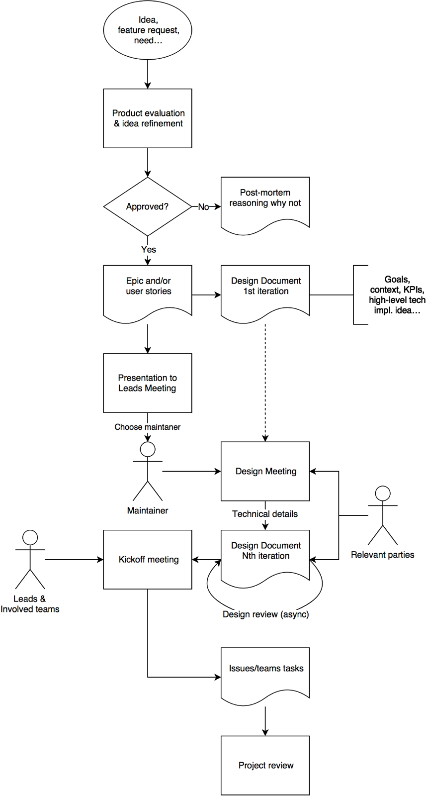

# General Workflow

* [Intro](#intro)
* [High level description and goals](#high-level-description-and-goals)
* [Detailed Process](#detailed-process)
  * [Idea, feature request, need](#idea-feature-request-need)
  * [Product evaluation & idea refinement](#product-evaluation-idea-refinement)
  * [Epics and/or User Stories](#epics-andor-user-stories)
  * [Design document 1st iteration](#design-document-1st-iteration)
  * [Presentation to Leads Meeting](#presentation-to-leads-meeting)
  * [Leads Meeting](#leads-meeting)
  * [Maintainer](#maintainer)
  * [Design Meeting](#design-meeting)
  * [Design Document Nth iteration](#design-document-nth-iteration)
  * [Kickoff Meeting](#kickoff-meeting)
  * [Issues/teams tasks](#issuesteams-tasks)
  * [Project Review](#project-review)

## Intro

These based in the notes from:

* 2018-01-09 Scrum of Scrums
* 2018-01-10/11 Workflow discussions
* 2018-03-01 Engineering Retrospective

## High level description and goals

The idea is to standardize the workflow when bringing new ideas, feature request
or needs, representing a substantial development effort or change in the product
philosophy, and make sure things are built with the adequate involvement of
people, approval process, documentation, reasoning on why and how we should be
working on something. Mindfulness and meaningfulness are key.

The process aims to either validate and refine or dismiss initial ideas (coming
from anyone) as soon as possible and limit the committed time and resources
while documenting the processes along the way.

By design, potential number of people involved is growing at every step of the
process list below, in order to solicit good feedback from widest possible
audience. Then it is narrowed down to fewer people in order to make the
decision-making happen. The time and commitment in each step in the process
depends on the scope and relative importance of the project.

It is expected that research projects run through the same workflow, even though
we are aware that the level of detail and duration of earlier steps will be
shorter, and the number of iterations and duration of later steps will be longer.

This is a constant work-in-progress and will evolve according to our experience.

A high-level flowchart can be seen below:

## Detailed Process

### Idea, feature request, need

The idea, feature request or need can come from basically anyone inside or
outside of the company. It doesn't need to be thoroughly detailed and evolved as
these will be part of the process, but the more context the better.

Ideas can be proposed by anyone at the company any time at the
[Features & Ideas repository](https://github.com/src-d/feature-idea/).
If the need, idea or feature request is related to an existing issue in another
repository, it can be linked directly from there with any additional context.

**Important: focus should be on the problem, the what, rather than the solution or the how!**

### Product evaluation & idea refinement

The product team will evaluate requests based on the alignment with the
company's goals, strategy and portfolio of products, the needs of the
stakeholders, the due time frame and expected potential benefits versus efforts.

The requester and relevant stakeholders will be involved at this stage to really
understand the core issue behind each request and refine it before thinking of
how to solve or build it. At this point it becomes clearer if it is something we
want to move forward within the process.

#### If not approved

Give the relevant parties an explanation of why it was not approved for
implementation—at least at this point, as the context may change—and keep its
record for future reference.

#### If approved

Product and the relevant parties will turn the requests into the format of
Epics and/or User Stories (again, focus on the what) to be added to the company
Backlog. These in turn will prompt a first iteration of a design document.

### Epics and/or User Stories

An *epic* captures a large body of work. It is essentially a large user story that
can be broken down into a number of smaller stories. It usually takes weeks to
complete an epic.

A *story* or user story is a need or requirement that is expressed in a few
short sentences, ideally using non-technical language (again, to focus on the
what rather than the how).

For context, a task is a unit of work contained within a story, usually relevant
to the implementation of the story by the teams.

### Design document 1st iteration

The design document will initially focus on the context, goals, KPIs
(business/technical), possible alternatives, and a high-level idea of a
solution. [Template](https://docs.google.com/document/d/1NtbOeUt9mAm3vnseCuEwBvuOI4emSzv0QopvaMYKWU4/).

### Presentation to Leads Meeting

Every leads meeting newly approved requests added to the pipeline will be
briefly presented regarding context, goals, KPIs, potential high-level solution,
etc. A maintainer for this project will be chosen by the leads based on the
complexity, scope and capabilities of team members.

### Leads Meeting

The leads meeting happens weekly and is divided in three sections:

* A short & meaningful review of last week's accomplishments, and eventual blockers.
* A short pitch of newly approved ideas to be worked on, choosing the maintainers.
* A more preemptive part, involving re-prioritization and cross-team organization if necessary.

### Maintainer

The maintainer of the project will be responsible for organizing the high-level
(team)work involved in the further steps of the workflow and the design document
of a project. Not necessarily the given repository maintainer, although
generally would be sensible to do so.

### Design Meeting

The design meeting will bring the first more detailed proposal of solution to
the problem to the relevant parties, and will then prompt further iterations
upon it as necessary to refine it. The maintainer chooses who to invite to the
meeting besides the Head of Product and the CTO.

### Design Document Nth iteration

The design document will be iterated upon N times asynchronously by everyone
involved according to necessary to refine a technical solution good enough to be
worked on. Things are expected to change and adapt as the project unfolds,
problems are discovered, etc.

### Kickoff Meeting

Once a solution is refined well enough to be worked on and iterations slow down,
a kickoff meeting is prompted with presence of the leads, the CTO and relevant
people from the teams to present it and organize the implementation, distribute
responsibilities to teams and people, and break down tasks and dependencies.

### Issues/teams tasks

Issues are created for the involved teams with all the foreseeable tasks
necessary for the implementation of the proposed solution. Tasks should be
atomic and clear enough so that people can pick these from the team Kanban and
work on them.

### Project Review

After a project has either failed or is finished, a technical review is prompted
to document the technical outcomes, problems and lessons of it. A
product/business review also takes place either at the same time or later on,
depending on the time necessary to evaluate the outcomes.

The post-mortem is documented so that it can be referred to in the future and
the whole team is able to learn from it. In the same spirit as the design doc,
one post-mortem document covers both product and technical parts.
