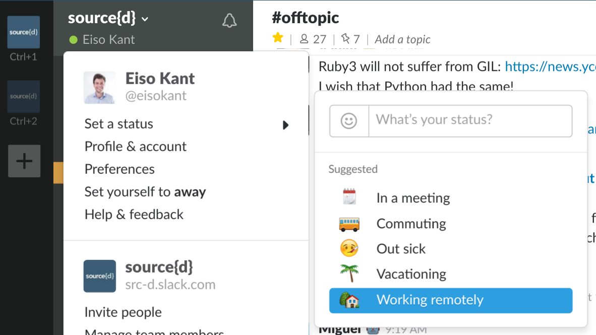
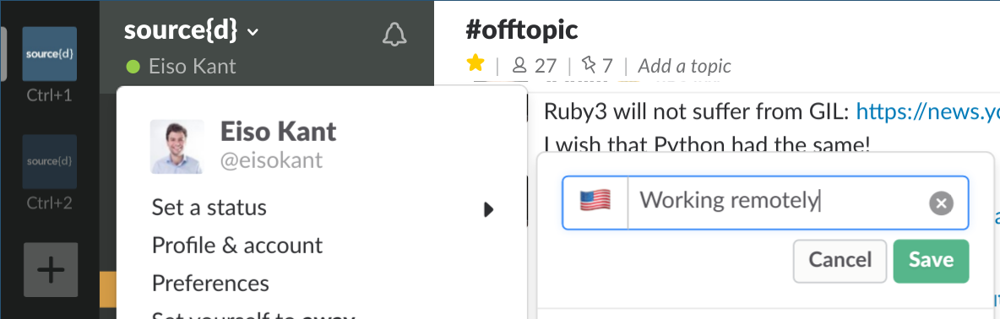

# Company Wide Remote Guidelines

source{d} is fully remote friendly, what this means is that you can choose to be full-time remote from the Faroe Islands or work from the Madrid or San Francisco office but spend mornings/afternoons/several days remote. 

A few practices that we have: 

### Slack

When you are working remote please update your Slack status (using the house icon or a foreign flag based on the country you're in):

**When at home:**

**When travelling:**

If you are abroad, update your Time Zone in `Profile & account > Edit Profile > Time Zone` so other people know which is your current time. Alternatively, you can just click on your name on any of your messages and click on _Edit your profile_.

### Calendar

If you're working from one of the offices but decide to be part-time remote, the team appreciates it if you update the Remote & OSD calendar.
