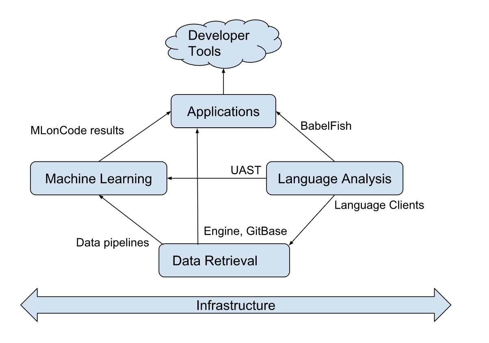
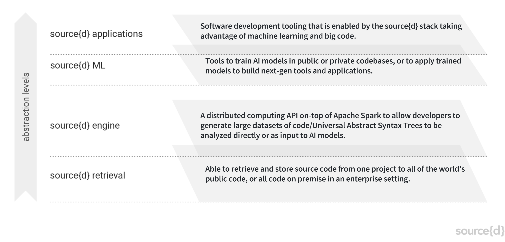

This document describes the engineering teams at source{d} and how they interact with each other.

### Machine Learning Team

- The Machine Learning team is focused on providing intelligent insights into nearly all the world's Open Source code. This includes typical Big Data analysis as well as solving sophisticated Machine Learning problems. The former is conducted on Apache Spark clusters, the latter leverages extensive GPGPU acceleration on custom hardware using Deep Learning techniques. Often ML problems we face are unsupervised and require novel research in the domain of ML on source code (MLonCode).

### Applications Team

- The Applications team applies the whole stack and expertise to solve real word problems such as automated code review, bug detection & prediction, test cases generation, security vulnerabilities and more. This is done by implementing CLI/Web applications on top of the MLonCode research as well as the other teams' main tools, like BabelFish and Engine. Simple and intuitive applications are written mainly in Go and Scala.

### Data Retrieval Team

- The Data Retrieval team is developing source{d}'s high-level Engine for running scalable data retrieval pipelines that process and manipulate any number of code repositories for source code analysis. Written mostly in Scala, it aims to be robust, friendly and flexible: it is built on top of Apache Spark, accessible both via Scala and Python Spark APIs, and capable of running on large-scale distributed clusters over petabytes of data. This core tool will be used for building source{d}'s unique global scale open dataset of +60M code repositories for our Machine Learning research on source code.

- Besides that, the team is developing GitBase, an SQL interface to Git repositories written in Go.


### Language Analysis Team

- The Language Analysis team is developing source{d} tools and libraries for generating and processing universal abstract syntax trees for programming languages. These components are integrated into the Babelfish Open Source project, written in Go, C++, Scala, and any other language that we're parsing.

- Babelfish powers the cutting-edge research that our Machine Learning team does on their ambitious mission to provide Machine Learning on Source Code. Our tools also are being used by a community of developers, researchers, and companies across the world in order to do vanguard research and build the next generation of developer tools.

### Infrastructure Team

- The Infrastructure team focuses on managing and growing our bare metal computation cluster. This cluster allows us to run large scale computational algorithms and store the required information for those computations.

- Besides that, the infrastructure team is also in charge of several other important services, such as databases, queues, CI, monitorization, logging, etc.

### Communication

- The ```Applications``` team is responsible for building scalable developer tools on top of the research of the ```Machine Learning``` team and code analysis of the ```Language Analysis``` team. The ```Data Retrieval``` team retrieves and processes public source code in order to build the data pipelines for the Machine Learning team’s models with the support of ```Language Analysis```. Also, BabelFish from ```Language Analysis``` team is used in order to generate the datasets as Universal Abstract Syntax trees to be analyzed directly or given as input data to train the ML models. All the necessary services and computational clusters for every team, are supported by the ```Infrastructure team```.

- This communication flow within the teams can be shown in the below diagram:



- Below are shown these interaction layers in an abstract way: 



